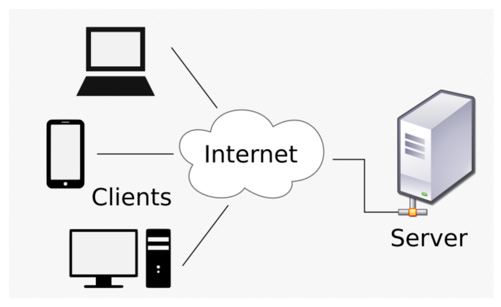
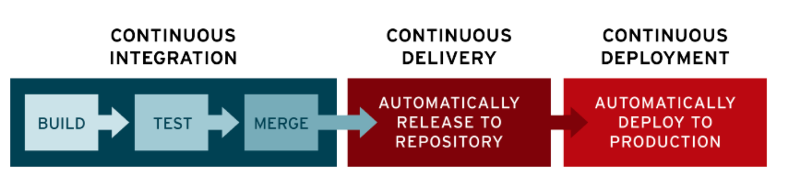

# 중간고사 대비용 SPRINGBOOT 파일

# CH01

## 1. 아파치 메이븐(Maven)

메이븐은 2002년에 시작해 2003년 아파치 소프트웨어 재단에서 최상위 프로젝트가 됨

xml형식의 pom.xml 파일에 프로젝트에서 사용할 의존성과 플러그인을 적기만 하면 된다.

mvn  명령어를 실행할 때, 어떤 단계를 완료할지 지정해서 컴파일, 이전 빌드에서 생성된 산출물 삭제, 패키징, 애플리케이션 실행 등 원하는 작업을 수행한다.

또한, 컨벤션에 따라 특정한 프로젝트 구조를 생성한다.

**메이븐 프로젝트의 기본 디렉토리 구조**

- sample
  - src
    - main
      - java : 자바 소스파일
      - resources : 프로퍼티나 XML등 프로퍼티 파일, 클래스 패스에 포함된다.
      - webapp : 웹 어플리케이션 파일 (WEB-INF 폴더, JSP 파일 등)
    - test
      - java : 테스트 자바 소스 파일
      - resources : 테스트 리소스

## 2. 그레이들(Gradle)

그레이들은 JVM(Java Virtual Machine)  프로젝트를 빌드할 때 널리 사용

2008년 출시된 DSL(Domain Specific Language, 도메인 특화 언어)로 최소한의 코드로 유연한 빌드 파일 build.gradle 을 생성한다.

## 3. 서버와 클라이언트



## 4. 클라이언트란?

클라이언트(client) 는 서버로 요청하는 프로그램을 모두 통칭

웹브라우저가 대표적인 클라이언트 중 하나

## 5. 서버란?

서버(server)는 클라이언트의 요청을 받아 처리하는 주체

클라이언트가 데이터를 요청했다면 서버 내에서 해당 요청을 처리 

웹브라우저에 주소를 입력하는건 ‘새로운 화면을 그리기 위한 데이터를 달라’는 데이터 요청에 해당

## 6. 데이터베이스

데이터베이스(databse)는 여러 사람이 데이터를 한 군데에 모아놓고 여러 사람이 사용할 목적으로 관리하는 데이터 저장소이다.

흔히  MySQL, Oracle, postgreSQL 등이 있다.

## 7. RBD란?

데이터베이스에는 RDB, NOSQL, NewSQL등 여러가지 종류가 있다.

그 중 가장 많이 사용하는 데이터베이스는 RDB (Relational Database) 로 관계형 데이터베이스가 있다.

관계형 데이터베이스는 데이터를 행과 열로 이루어진 테이블로 관리하며, 기본 키(Primary Key)를 사용해 각 행을 식별한다.

## 8. SQL이란?

SQL은 Structured Query Langugae 의 약자로 말그대로 쿼리, 즉 데이터 검색을 하는 언어

SQL도 하나만 있는 것이 아니라 ANSI 표준 SQL이 있고, 각 RDB 별로 방언이 있다.

## 9. NoSQL이란?

NoSQL의 뜻이 SQL을 안쓴다는 의미로 사용되기도 하지만, Not Olny SQL 의 의미로 많이 사용한다.

RDB는 데이터의 저장, 질의, 수정, 삭제가 용이하지만 성능을 올리는게 쉽지 않다

데이터베이스의 성능을 높이려면 머신의 성능을 좋게 하는 스케일업 또는 머신을 여러대로 분리하는 스케일 아웃이라는 것이 필요하다.

스케일업은 장비를 업그레이드 하면 되지만 스케일 아웃은 데이터베이스를 분산하고, 이때 트랜잭션을 사용하면 성능이 떨어지게 된다. RDB의 이러한 문제를 해결하기 위해 NoSQL 이 등장했으면, 데이터모델링을 어떻게 하느냐에 따라 DynamoDB, MongoDB 와 같은 다양한 NoSQL 데이터베이스들이 있다.

## 10. 아이피와 포트

아이피(IP)는 인터넷에서 컴퓨터 또는 기기들이 서로를 식별하고 통신하기 위한 주소

아이피를 알면 서버를 찾을 수 있지만 서버를 이용하려면 포트까지 알아야 한다.

아이피가 서버를 찾기위한 번호라면, 포트는 그 서버에서 운용되고 있는 서비스를 구분하기 위한 번호

웹브라우저에 주소에는 사실 아이피와  포트가 들어있다.

[www.naver.com](http://www.naver.com) 과 같은 주소는 아이피를 쉽게 알아보기 위해 이름표를 붙인것이고

그 앞에 https://라는 것은 서버의 443번 포트를 사용하기 위한 입력이다.

**터미널에서 도메인의 IP 확인하기**

터미널에서 간단한 명령어로 도메인의 IPv4 주소를 확인할 수 있다.터미널을 열고, `nslookup naver.com` 을 입력하면 된다.

**IPv4**

IPv4(Internet Protocol version 4)는 IP 주소체계의 네 번째 버전을 뜻한다.IPv4는 각 덩어리 마다 0부터 255까지 나타낼 수 있다.이 시스템을 따르면, 2^(32)인 약 43억 개의 IP 주소를 표현할 수 있다.그 중에서 몇 가지는 이미 용도가 정해져 있다.

**용도가 정해져 있는 IP 주소**

`localhost`, `127.0.0.1` : 현재 사용 중인 로컬 PC를 지칭한다.`0.0.0.0`, `255.255.255.255` : broadcast address, 로컬 네트워크에 접속된 모든 장치와 소통하는 주소이다.서버에서 접근 가능 IP 주소를 broadcast address 로 지정하면, 모든 기기에서 서버에 접근할 수 있다.

**IPv6**

인터넷 보급률이 낮았던 초기에는 IPv4(IP version 4)으로 네트워크에 연결된 PC에 주소를 할당하는 일이 가능했다.그러나 개인 PC의 보급으로 전 세계의 누구나 PC를 이용해 인터넷에 접속하고, 각종 서비스를 위해 서버를 생산하면서 IPv4로 할당할 수 있는 PC가 한계를 넘어서게 되었다.이를 해결하기 위해서 세상에 나오게 된 것이 IPv6(IP version 6) 이다.IPv6는 표기법을 달리 책정하여 2^(128)개의 IP 주소를 표현할 수 있다.

## 11. 라이브러리란?

라이브러리(library) 는 애플리케이션 개발에 필요한 기능인 클래스, 함수 등을 모아놓은 코드의 모음

개발자가 소프트웨어를 만들때 필요에 따라 원하는 기능을 구현하기 위해 코드의 모음을 가져다 쓸 수 있는 일종의 도구의 역할

따라서, 개발자는 복잡한 코드를 직접 작성하지 않아도 되므로 원하는 기능을 더 빠르게 개발할 수 있으며, 라이브러리는 독립적이므로 라이브러리 끼리 영향을 크게 주지 않는다.

## 12. 프레임워크란?

프레임워크(framework)란 소프트웨어 개발을 수월하게 하기 위한 소프트웨어 개발 환경

프레임워크는 툴(frame)과 일하다(work)의 합성어로 일하기 위한 툴을 제공하는 것

개발자는 그 들에서 일을 해야한다는 단점이 있지만 개발 효율은 굉장히 높다는 장점이 있다.

프레임워크는 애플리케이션을 개발할 때 전체적인 구조를 잡기 위해 사용하는 것이고, 라이브러리는 개발을 하는 과정에서 필요한 기능을 구현하기 위해 사용하는 것.

## 13. 백엔드 개발자의 업무

백엔드 개발자의 주된 업무는 서버 측 애플리케이션을 개발하는 일로 개발하면서 서버에 대한 지식과 프로그래밍 지식, 만들 프로그램을 배포하고 안전하게 서비스할 수 있게 하는 지식을 활용한다. 

백엔드 개발자의 업무는 조직마다 천차만별이지만 대개는

과제할당 → 과제분석 → 개발 → 테스트(리뷰) → QA 및 버그 수정 → 배포 → 유지보수 의 순서로 진행한다.

**QA** : Quality assurance

개발과 테스트가 어느정도 마무리됐다면, 애플리케이션의 품질을 높이기 위해 QA를 진행한다.

**배포와 유지보수**

QA가 완료되면 서버에 배포를 진행

때에 따라서 여러 과제를 한 번에 병합해서 배포하거나, 새로운 기능이 추가될 때마다 배포한다.

여러가지 배포방법

- 롤링 배포 : 특정 개수의 서버들을 돌아가며 배포
- 블루그린 배포: 똑같은 서버 인스턴스를 띄우고 로드밸런서 설정을 바꾼다
- 카나리 배포 : 전체 서버의 특정 비율만큼 배포해보고 문제없는 경우 점점 배포를 늘려가는 배포

빌드부터 배포까지의 과정을 자동화 → CI(Continuous Integration) / CD(Continuous Delivery & Continuous Deployment) 라고 한다.



- CI : 지속적인 통합, 새로운 코드 변경 사항이 정기적으로 빌드 및 테스트되어 저장소에 통합되는 것을 의미
- CD : 지속적인 배포

CI는 저장소에 코드가 반영되는 것을 말하고, CD는 실제 프로덕션 환경까지 변경된 코드가 반영되는 것

## 14. 자바 어노테이션

Java annotaion 은 자바로 작성한 코드에 추가하는 표식

보통 @ 기호를 사용하며 JDK1.5 버전부터 사용할 수 있다.

@Overrid | 선언된 메서드가 오버라이드 되었음

@Deprecated | 더 이상 사용 되지 않음

@SuppressWarnings | 컴파일 경고를 무시함

---

<br>

# CH02

## 1. 스프링의 등장

- 엔터프라이즈 애플리케이션 : 대규모의 복잡한 데이터를 관리하는 애플리케이션

소프트웨어 분야가 발전하면서 엔터프라이즈 애플리케이션은 점점 복잡해졌음

 예를 들어 은행 시스템을 생각해보면 몇 백만, 아니 몇 천만의 사람이 한꺼번에 잔고 조회를 하고, 입금이나 출금 요청을 하거나 새로운 통장을 개설하기도 한다.

이처럼 엔터프라이즈 애플리케이션은 많은 사용자들의 요청을 동시에 처리해야 하므로 서버 성능과 안정성, 보안이 매우 중요하다. → 스프링프레임워크가 이러한 서버 성능, 안정성, 보안을 매우 높은 수준으로 제공하는 도구

## 2. 스프링부트

스프링은 장점이 많은 개발 도구이지만 설정이 매우 복잡하다는 단점 → 보완을 위해 스프링 부트 출시

- 빠르게 스프링 프로젝트를 설정
- 의존성 세트라고 불리는 스타터를 사용해 간편하게 의존성을 사용하거나 관리
- 톰캣, 제티, 언더토우와 같은 웹 어플리케이션 서버(WAS)가 내장되어 있어 따로 설치하지 않아도 독립적으로 실행 가능
- JAR 를 이용해 자바 옵션만으로도 배포가 가능
- 애플리케이션 모니터링 및 관리도구인 스프링 액츄에이터(Spring actuator)를 제공

## 3. 차이점1. 구성의 차이

- 스프링 : 애플리케이션 개발에 필요한 환경을 수동으로 구성하고 정의해야 함
- 스프링부트 :  스프링 코어와 스프링 MVC 의 모든 기능을 자동으로 로드하므로 수동으로 개발 환경을 구성할 필요가 없음

## 4. 차이점2. 내장 WAS의 유무

스프링애플리케이션은 일반적으로 톰캣과 같은 WAS에서 배포됨.

WAS란 간단히 웹 애플리케이션을 실행하기 위한 장치

||**스프링**| **스프링부트**|
|---|---|---|
|**목적**|엔터프라이즈 애플리케이션 개발을 쉽게 도와줌|스프링의 개발을 더 빠르고 쉽게 하기|
|**설정파일**|개발자가 수동으로 구성|자동 구성|
|**XML**|일부 파일은 XML로 직접 생성하고 관리|사용하지 않음|
|**인메모리 데이터베이스 지원**|지원하지 않음| 자동 설정 지원|
|**서버**|별도 설치 후 수동 설정|내장형 서버를 제공해 별도 설정이 필요 없음|


## 5. 제어의 역전과 의존성 주입

스프링은 모든 기능의 기반을 제어의 역전(IoC)과 의존성 주입(DI)에 두고 있다.

## 6. IoC

IoC (Inversion of Control) 을 줄인 표현 → 제어의 역전

자바 코드를 작성해 객체를 생성할 때 객체가 필요한 곳에서 직접 생성했다.

```Groovy
public class A {
	b = new B(); // 클래스 A에서 new 키워드로 클래스 B 객체 생성
}
```
제어의 역전은 다른 객체를 직접 생성하거나 제어하는것이 아니라 외부에서 관리하는 객체를 가져와 사용하는 것을 말한다.

스프링은 스프링 컨테이너가 객체를 관리, 제공하는 역할을 한다.

## 7. DI

앞서 설명한 제어의 역전을 구현하기 위해 사용하는 방법이 DI(Dependency Injection) -> 의존성 주입

DI는 어떤 클래스가 다른 클래스에 의존한다는 뜻

```Groovy
public class A {
	// A에서 B를 주입받음
	@Autowired
	B b;
}
```
@Autowired : 스프링 컨테이너에 있는 빈이라는 것을 주입하는 역할

Bean(빈) : 스프링컨테이너에서 관리하는 객체

## 8. 스프링컨테이너

스프링컨테이너는 빈을 생성하고 관리

빈이 생성되고 소멸되기까지의 생명주기를 스프링컨테이너가 관리하며, @Autowired 같은 어노테이션을 이용해 빈을 주입받을 수 있게 DI를 지원

## 9. 빈(Bean)

빈은 스프링컨테이너가 생성하고 관리하는 객체로 스프링은 빈을 스프링컨테이너에 등록하기 위해 XML설정, 어노테이션 추가 등 여러 방법으로제공

예를 들어 MyBean이라는 클래스에 @Compoent 어노테이션을 붙이면 MyBean클래스가 빈으로 등록

이때 빈 이름은 클래스 이름의 첫글자를 소문자로 바꾸어 관리 → myBean

```Groovy
@Compontent
public class MyBean {
}
```

## 10. AOP - 관점 지향 프로그래밍

AOP (Aspect Oriented Programing) 으로 프로그래밍에 대한 관심을 핵심 관점, 부가 관점으로 나누어서 관심 기준으로 모듈화 하는 것을 의미

예를 들어 계좌 이체, 고객 관리하는 프로그램이 있을 때 각 프로그램에는 로깅 로직, 즉 지금까지 벌어진 일을 기록하기 위한 로직과 여러 데이터를 관리하기 위한 데이터베이스 연결 로직이 포함

이때 관점은 계좌이체, 고객 관리 로직

부가관점은 로깅, 데이터베이스 연결 로직  → 부가 관점 코드를 핵심 관점 코드에서 분리 → 핵심 관점 코드에만 집중할 수 있고, 프로그램의 변경과 확장에 유연하게 대응가능

## 11. PSA - 이식 가능한 서비스 추상화

PSA (Portable Service Abstraction) 은 스프링에서 제공하는 다양한 기술들을 추상화해 개발자가 쉽게 사용하는 인터페이스

예를 들어 스프링에서 데이터베이스에 접근하기 위한 기술로 JPA,MyBatis, JDBC같은 것들이 있는데 어떤 기술을 사용하든 일관된 방식으로 데이터베이스에 접근하도록 인터페이스를 지원

## 12. 스프링부트 스타터

스프링부트 스타터는 의존성이 모여있는 그룹으로 스타터를 사용하면 필요한 기능을 간편하게 설정할 수 있다.

스타터는 `spring-boot-starter-{작업유형}` 이라는 명명규칙 있음

| 스타터 | 설명 |
| --- | --- |
|  spring-boot-starter-web | SpringMVC를 사용해 RESTFul 웹 서비스를 개발할 때 필요한 의존성 모음 |
|  spring-boot-starter-test | 스프링애플리케이션을 테스트하기 위해 필요한 의존성 모음 |
|  spring-boot-starter-validation | 유효성 검사를 위해 필요한 의존성 모음 |
|  spring-boot-starter-actuator | 모니터링을 위해 애플리케이션에서 제공하는 다양한 정보를 제공하기 쉽게하는 의존성 모음 |
|  spring-boot-starter-jpa | ORM을 사용하기 위한 인터페이스 모음인 JPA를 더 쉽게 사용하기 위한 의존성 모음 |

## 13. 자동 구성

스프링부트에서는 애플리케이션이 최소한의 설정만으로도 시행되게 여러 부분을 자동을 구성

스프링부트는 서버를 시작할 때 구성 파일을 읽어와서 설정 → 자동설정

자동설정 파일 : META-INF > spring.factories

## 14. 스프링부트 3와 자바 버전

스프링부트 3 이전과 이후는 사용할 수 있는 자바 버전 범위가 다르다.

스프링부트 2는 자바 8버전 이상, 스프링부트 3은 자바 17버전 이상

### **자바 17 주요 변화**

**텍스트 블록**

이전에는 여러 줄의 텍스트를 작성하려면 `\n` 을 추가해야 했지만 이제는 `“””` 로 감싼 텍스트를 사용해 여러 줄의 텍스트를 표현할 수 있다.

**formatted()  메서드**

**레코드**

레코드는 데이터 전달을 목적으로 하는 객체를 더 빠르고 간편하게 만들기 위한 기능

레코드는 상속을 할 수 없고 파라미터에 정의한 필드는 private final 로 정의된다.

또한 레코드는 게터(getter)를 자동으로 만들기 때문에 어노테이션이나 메서드로 게터를 저의하지 않아도 된다.

**패턴매칭**

패턴 매칭은 타입 확인을 위해 사용하던 instanceof 키워드를 조금 더 쉽게 사용할 수 있게 함

이전에는 instanceof 키워드와 형변환 코드를 조합해야 했지만 이제는 바로 형변환을 한다음 사용가능

**자료형에 맞는 case 처리**

switch-case문으로 자료형에 맞게 case 처리할 수 있음

**Servlet, JPA의 네임스페이스가 Jakarta로 대체**

패키지 네임스페이스가 `javax.*` 에서 `jakarta.*` 로 변경

**GraalVM기반의 스프링 네이티브 공식 지원**

스프링애플리케이션을 네이티브 이미지로 컴파일해 JVM에 구동되는 애플리케이션에 비해 시작시간과 메모리 오버 헤디를 줄일 GraalVM기반의 스프링 네이티브를 공식 지원

JVM실행파일과 비교해 네이티브 이미지를 사용하면 가동시간이 짧아지고 메모리를 더 적게 소모

## 15. 스프링 부트 3 코드 이해하기

- @SpringBootApplication

@SpringBootApplication 어노테이션을 추가하면 스프링 부트 사용에 필요한 기본 설정을 해준다

SpringApplication.run() 메서드는 애플리케이션을 실행

    - 첫 번째 인수는 스프링부트3 애플리케이션의 메인 클래스로 사용할 클래스
    - 두 번째 인수는 커맨드 라인의 인수들을 전달

- @SpringBootConfiguration
  - 스프링부트관련 설정을 나타내는 어노테이션
  - @Configuration을 상속해서 만든 어노테이션
- @ComponentScan
  - 사용자가 등록한 빈을 읽고 등록하는 하는 어노테이션
  - @Component 라는 어노테이션을 가진 클래스들을 찾아 빈으로 등록하는 역할

|||
| --- | --- |
| @Configuration | 설정 파일 등록 |
| @Repository | ORM 매핑 |
| @Controller, @RestController | 라우터 |
| @Service | 비즈니스 로직 |

- @EnableAutoConfiguration
  - 스프링부트에서 자동 구성을 활성화 하는 어노테이션
  - 스프링부트 서버가 실행될 때 스프링부트의 메타 파일을 읽고 정의된 설정들을 자동으로 구성하는 역할

---

<br>

# CH3

## 1. 계층

계층이라는 것은 각자의 열할과 책임이 있는 어떤 소프트웨어의 구성 요소를 의미

각 계층은 서로 소통할 수 있지만 다른 계층은 직접 간섭하거나 영향을 미치지 않는다.

## 2. 프레젠테이션 계층

HTTP 요청을 받고 이 요청을 비지니스 계층으로 전송하는 역할

컨트롤러가 바로 프레젠테이션 계층의 역할을 한다.

## 3. 비지니스 계층

모든 비지니스 로직을 처리한다.

비즈니스 로직이란 서비스를 만들기 위한 로직 -> 웹 사이트에서 벌어지는 모든 작업

예를 들어 주문 서비스라고 한다면 주문 개수, 가격 등의 데이터를 처리하기 위한 로직, 주문 처리를 하다 발생한 예외 처리 로직, 주문을 받거나 취소하는 것 같이 프로세스를 구현하기 위한 로직

서비스가 비즈니스 계층의 역할을 한다.

## 4. 퍼시스턴스 계층

모든 데이터베이스 관련 로직을 처리한다.

이 과정에서 데이터베이스에 접근하는 DAO 객체를 사용할 수 도 있다.

DAO는 데이터베이스 계층과 상호작용을 하기위한 객체

리포지토리가 퍼시스턴스 계층의 역할을 한다.

# 5. 스프링부트 디렉토리 구성

- main : 실제 코드를 작성하는 공간으로 프로젝트 실행에 필요한 소스 코드나 리소스 파일은 모두 이 폴더안에 있다.

- test : 프로젝트의 소스 코드를 테스트할 목적의 코드나 리소스 파일이 들어있다.

- build.gradle : 빌드를 설정하는 파일로 의존성이나 플로그인 설정 등과 같이 빌드에 필요한 설정을 할 때 사용

- setting.gradle : 빌드할 프로젝트의 정보를 설정하는 파일

# 6. main 디렉터리

main 디렉터리를 펄치면 java와 resources로 구성

main
- java
- resources
  - templates : HTML과 같은 뷰 관련 파일 위치
  - static : js, css, 이미지와 같은 정적 파일 위치

# 7. build.gradle에 의존성 추가하기

- 스프링 부트용 JPA인 스프링데이터 JPA
- 로컬 환경과 테스트 환경에서 사용할 인메모리 데이터베이스 H2
- 반복 메서드 작성 작업을 줄여주는 롬복

---

<br>

# CH4

## 1. 테스트 코드 개념

테스트 코드는 작성한 코드가 의도대로 잘 작동하고 예상치 못한 문제가 없는지 확인할 목적으로 작성하는 코드

## 2. 테스트 코드란?

test 디렉토리에서 작업

테스트 코드에도 다양한 패턴이 있는데, 그중 given-when-then 패턴 이용

given-when-then 패턴은 테스트 코드를 세 단계로 구분하여 작성하는 방식

- given : 테스트 실행을 준비하는 단계
- when : 테스트를 진행하는 단계
- then : 테스트 결과를 검증하는 단계

## 3. 스트링부트3 테스트

스프링부트는 애플리케이션을 테스트하기 위한 도구와 어노테이션을 제공한다

spring-boot-starter-test

- JUnit : 자바 프로그래밍 언어용 단위 테스트 프레임워크
- Spring Test & Spring Boot Test : 스프링부트 애플리케이션을 위한 통합 테스트 지원
- AssertJ : 검증문인 어설션을 작성하는데 사용되는 라이브러리
- Hamcrest : 표현식을 보다 이해하기 쉽게 만드는데 사용되는 Matcher 라이브러리
- Mockito : 데스트에 사용할 가짜 객체인 목 객체를 쉽게 만들고, 관리하고, 검증할 수 있게 지원하는 테스트 프레임 워크
- JSONassert : JSON용 어설션 라이브러리
- JsonPath : JSON 데이터에서 특정 데이터를 선택하고 검색하기 위한 라이브러리

## 4. JUnit

JUnit 은 자바 언어를 위한 단위 테스트 프레임워크

단위 테스트란 작성한 코드가 의도대로 작동하는지 작은 단위로 검증하는 것을 의미

이때 단위는 보통 메서드가 된다.

- 테스트 방식을 구분할 수 있는 어노테이션을 제공
- @Test 어노테이션으로 메서드를 호출할 때마다 새 인스턴스를 생성, 독립 테스트 가능
- 예상 결과를 검증하는 어셜션 메서드 제공
- 사용 방법이 단순, 데스트 코드 작성시간이 적음
- 자동 실행, 자체 결과를 확인하고 즉각적인 피드백을 제공

## 5. Junit으로 단위 테스트 코드

- @DisplayName : 테스트 이름을 명시
- @Test : 어노테이션을 붙인 메서드는 테스트를 수행하는 메서드가 된다.

JUnit 은 테스트끼리 영향을 주지 않도록 각 테스트를 실행할 때마다 테스트를 위한 실행 객체를 만들고 테스트가 종료되면 실행 객체를 삭제한다.

- assertEquals : 첫 번째 인수에는 기대하는 값, 두 번째 인수에는 실제로 검증할 값을 넣어준다.
- @BeforeAll
  - 전체 테스트를 시작하기 전에 처음으로 한 번만 실행
  - 예를 들어 데이터베이스를 연결해야 하거나 테스트 환경을 초기화 할 때 사용
  - 전체 테스트 실행 주기에서 한번만 호출되어야 하기 때문에 메서드를 static으로 선언
- @BeforeEach
  - 테스트 케이스를 시작하기 전에 매번 실행
  - 예를 들어 메서드에서 사용하는 객체를 초기화하거나 테스트에 필요한 값을 미리 넣을 때 사용
  - 각 인스턴스에 대해 메서드를 호출해야 하므로 메서드는 static 이 아니어야 한다.
- @AfterAll
  - 전체 테스트를 마치고 종료하기 전에 한 번만 실행
  - 예를 들어 데이터베이스 연결을 종료할 때나 공통적으로 사용하는 자원을 해제할 때 사용
  - 전체 테스트 실행 주기에서 한번만 호출되어야 하기 때문에 메서드를 static 으로 선언
- @AfterEach
  - 각 테스트 케이스를 종료하기 전 매번 실행
  - 예를 들어 테스트 이후에 특정 데이터를 삭제해야하는 경우 사용

## 6. AssertJ로 검증문 가독성 높이기

AssertJ는 JUnit과 함께 사용해 검증문의 가독성을 확 높여주는 라이브러리

|메서드 이름|설명|
|---|---|
|isEqualTo(A)|A 값과 같은지 검증|
|isNotEqualTo(A)|A 값과 다른지 검증|
|contains(A)|A 값을 포함하는지 검증|
|doesNotContain(A)|A 값을 포함하지 않는지 검증|
|startsWith(A)|접두사가 A 인지 검증|
|endsWith(A)|접미사가 A 인지 검증|
|isEmpty()|비어있는 값인지 검증|
|isNotEmpty()|비어있지 않은 값인지 검증|
|isPositive()|양수인지 검증|
|isNegative()|음수인지 검증|
|isGreaterThan(1)|1보다 큰 값인지 검증|
|isLessThan(1)|1보다 작은 값인지 검증|

## 7. 테스트 코드

- @SpringBootTest : 메인 애플리케이션 클래스에 추가하는 어노테이션으로 @SpringBootApplication이 있는 클래스를 찾고 그 클래스에 포함되어 있는 빈을 찾은 다음 테스트용 어플리케이션 컨텍스트라는 것을 만든다.
- @AutoConfigureMockMvc : MockMvc를 생성하고 자동으로 구성하는 어노테이션으로 MockMvc는 어플리케이션 서버에 배포하지 않고도 테스트용 MVC 환경을 만들어 요청 및 전송 응답기능을 제공하는 유틸리티 클래스 → 컨트롤러 테스트시 사용
- perform() : 요청을 전송하는 역할을 하는 메서드로 그 결과로 ResultActions객체를 받으며 ResultActions 객체는 반환값을 검증하고 확인하는 andExpect() 메서드를 제공
- accept() : 요청을 보낼 때 무슨 타입으로 응답을 받을지 결정하는 메서드
- andExpect() : 응답을 검증. isOk()를 사용해 응답코드가 200인지 확인
- jsonPath(”$[0].${필드명}”) : JSON 응답값의 값을 가져오는 역할

|코드|매핑 메서드|
|---|---|
|200 OK|isOK()|
|201 Created|isCreated()|
|400 Bad Request|isBadRequest()|
|403 Forbidden|isForbidden()|
|404 Not Found|isNotFound()|
|400번대 응답코드|is4xxClientError()|
|500 Internal Sever Error|isInternalServerError()|
|500번대 응답코드|is5xxSeverError()|

---

<br>

# CH5

## 1. API 와 REST API

API (Application Programming Interface)  프로그램간에 상호작용하기 위한 매개체

API 아키텍처는 일반적으로 클라이언트와 서버 측면에서 설명

요청을 보내는 애플리케이션을 클라이언트라고 하고 응답을 보내는 애플리케이션을 서버라고 한다.

따라서 날씨 예에서 기상청의 날씨 데이터베이스는 서버이고 모바일 앱은 클라이언트

API가 생성된 시기와 이유에 따라 API는 네 가지 방식으로 작동할 수 있다.

## 2. SOAP API

이 API는 단순 객체 접근 프로토콜을 사용합니다. 클라이언트와 서버는 XML을 사용하여 메시지를 교환합니다. 과거에 더 많이 사용되었으며 유연성이 떨어지는 API

## 3. RPC API

이 API를 원격 프로시저 호출이라고 합니다. 클라이언트가 서버에서 함수나 프로시저를 완료하면 서버가 출력을 클라이언트로 다시 전송

## 4. Websocket API

Websocket API는 JSON 객체를 사용하여 데이터를 전달하는 또 다른 최신 웹 API 개발입니다. WebSocket API는 클라이언트 앱과 서버 간의 양방향 통신을 지원합니다. 서버가 연결된 클라이언트에 콜백 메시지를 전송할 수 있어 REST API보다 효율적

## 5. REST API (RESTful API)

오늘날 웹에서 볼 수 있는 가장 많이 사용되고 유연한 API입니다. 클라이언트가 서버에 요청을 데이터로 전송합니다. 서버가 이 클라이언트 입력을 사용하여 내부 함수를 시작하고 출력 데이터를 다시 클라이언트에 반환 

Representational State Transfer → REST

URL의 설계방식을 말함 → 주소와 메서드만 보고 요청의 내용을 파악할 수 있다.

예를 들어 A가 어플리케이션 B와 통신할 때, A는 B에서 통신 시점의 `현재상태(state)`를 가져온다.

A는 B 가 통신 호출(communication calls)간 `상태(현재 및 누적된 프로세스 정보)`’를 유지 하리라고 가정하지 않는다.

A는 B에 요청할 때마다 관련 `상태`의 `표현(representational)` 을 제공하고 이러한 동작 방식은 생존가능성과 회복탄력성을 향상시킨다.

이렇게 처리하는 이유는 통신문제가 발생하거나 B가 충돌해 재 시작 돼도, A와 상호작용한 ‘현재 상태’를 잃어버리지 않기 때문 → A가 다시 요청해 두 어플리케이션이 중단된 곳에서 통신을 이어간다.

**특징**

- 서버/클라이언트 구조 (**Client–server)**
  - 클라이언트와 서버는 서로 독립적이어야 하며, 클라이언트는 오직 URIs 리소스만 알아야한다.
  - 클라이언트와 서버의 인터페이스가 변경되지 않는 한, 이 둘은 독립적으로 개발되거나 대체될 수 있게 유지해야한다. (관심사의 명확한 분리)
- 무상태 (**Stateless)**
  - 클라이언트의 모든 요청에는 해당 요청을 이해할 수 있는 모든 정보가 포함되어야한다.
  - 서버는 HTTP 요청에 대한 어떤 것도 저장하지 않는다.
  - 컨텍스트를 유지해야하는 세션, 인증과 인가에 대한 정보 또한 클라이언트에만 보관되며, 각 요청 시 해당 정보를 모두 포함하여 서버에 요청한다.
- 캐시 처리 가능 (**Cacheable)**
  - 서버는 Response cache-control 헤더에 해당 요청이 캐싱이 가능한 지에 대한 여부를 제공해야 한다.
  - 이를 제공한다면 클라이언트는 Response를 캐싱하여 서버와 클라이언트 간의 상호작용을 줄이고, 성능과 서버 가용성을 늘릴 수 있다.
- 계층화 (**Layered system)**
  - REST는 다중 계층 구조를 가질 수 있도록 허용한다. (예를 들어 API 서버와 DB서버 그리고 인증 서버를 따로 둘 수 있도록)
  - 각 레이어는 자기와 통신하는 컴포넌트 외 레이어에 대해서는 정보를 얻을 수 없다.
  - 클라이언트는 REST 서버와만 상호작용할 뿐, REST가 상호작용하는 레이어나 그 외 중간 레이어들, end server에 직접적으로 요청할 수 없으며 이들의 상호작용 또한 볼 수 없다.
- 인터페이스 일관성 (**Uniform interface)**

**장점**

- URL만 보고도 무슨 행동을 하는 API인지 명확하게 알수 있다.
- 상태가 없다는 특징이 있어서 클라이언트와 서버의 역할이 명확하게 분리
- HTTP표준을 사용하는 모든 플랫폼에서 사용가능

**단점**

- HTTP 메서드 (GETP, POST 등)과 같은 방식의 개수에 제한
- 설계를 하기 위해 공식적으로 제공되는 표준 규약이 없다

**규칙**

- URL에는 동사를 쓰지 말고, 자원을 표시해야 한다.
  - URI(Uniform Resource Identifier)
    - Uniform: 리소스 식별하는 통일된 방식
    - Resource: 자원, URI로 식별할 수 있는 모든 것(제한 없음)
    - Identifier: 다른 항목과 구분하는데 필요한 정보
  - 자원은 가져오는 데이터를 말한다.
  - 예를 들어 학생 중에 id가 1인 학생의 정보를 가져오는 URL 설계
    ```SQL
    [1] /students/1
    [2] /getStudent?studentId=1
    ```
  - 위의 예제 중 REST API 더 맞는 API 는 1번
  - 2번의 경우 자원이 아닌 다른 표현을 섞어 사용했기 때문 → 어떤 개발자는 get을 어떤 개발자는 show를 쓰면 URL구조가 중구난방이 되므로 이런 **동사를 사용하지 않는다.**
- 동사는 HTTP 메서드로
  - 동사는 HTTP 메서드라는 것으로 해결
  - GET : 읽기 read
  - POST : 만들기 create
  - PUT : 업데이트 update
  - DELETE : 삭제 delete
  - OPTIONS : 요청/응답 쌍에서 사용할 수 있는 통신 옵션을 조회
  - HEAD : 응답 메시지에서 바디를 뺀 응답헤더를 조회

|||
|---|---|
|id가 1인 블로그글을 조회하는 API|GET /articles/1|
|블로그 글을 추가하는 API|POST /articles/1|
|블로그 글을 수정하는 API|PUT /articles/1|
|블로그 글을 삭제하는 API|DELETE /articles/1|

## 6. 엔티티 구성

| 컬럼명 | 자료형 | null 허용 | 키 | 설명 |
| --- | --- | --- | --- | --- |
| id | BIGINT | N | PK | 일련번호 - 기본키 |
| title | VARCHAR(255) | N |  | 게시물의 제목 |
| content | VARCHAR(255) | N |  | 게시물의 내용 |

## 7. domain 패키지 생성

@Builder 어노테이션은 롬복에서 지원하는 어노테이션으로 생성자위에 입력하면 빌더 패턴 방식으로 객체를 생성할 수 있어 편리하다.

빌더 패턴 

- 객체를 유연하고 직관적으로 생성할 수 있어 애용하는 디자인 패턴
- 빌더 패턴을 사용하면 어느 필드에 어떤 값이 들어가는지 명시적으로 파악할 수 있다.
- @NoArgsConstructor : 접근 제어자가 protected 인 기본 생성자 생성
- @Getter : 클래스 필드에 대해 게터 메서드 생성

## 8. 서비스 코드 작성

- dto 생성
  - DTO(data transfer object)는 계층끼리 데이터를 교환하기 위해 사용하는 객체
  - dao는 데이터베이스와 연결되고 조회하고 수정하는데 사용하는 객체
  - dto는 단순하게 데이터를 옮기기 위해 사용하는 전달자 역할을 하는 객체이므로 별도의 비즈니스 로직을 포함하지 않는다.

- @RequiredArgsConstructor : 빈을 생성자로 하는 롬복에서 지원하는 애너테이션으로 final 키워드나 @NotNull이 붙은 필드 생성자로 만들어 준다.
- @Service : 해당 클래스를 빈으로 서블릿 컨테이너에 등록해준다

## 9. 컨트롤러 작성

- @RestController
  - HTTP 응답으로 객체 데이터를 JSON 형식으로 반환
  - @Controller + @ResponseBody
- @ResponseBody : JSON 이나 XML 같은 데이터 형식으로 응답을 반환
- @RequestBody : HTTP 를 요청할 때 해당하는 값을 @ReqeustBody 어노테이션을 붙인 객체에 매핑
- ResponseEntity.status().body() 응답코드
  - 200 OK : 요청이 성공적으로 수행되었음
  - 201 Created : 요청이 성공적으로 수행되었고, 새로운 리소스가 생성되었음
  - 400 Bad Request : 요청 값이 잘못되어 요청에 실패했음
  - 403 Forbidden : 권한이 없어 요청에 실패했음
  - 404 Not Found : 요청 값으로 찾은 리소스가 없어 요청에 실패했음
  - 500 Internal Server Error : 서버 상에 문제가 있어 요처엥 실패했음

## 10. 테스트 코드 작성

**ObjectMapper**

- 이 클래스로 만든 객체는 자바 객체를 JSON데이터로 변환하는 직렬화 (serialization) 또는 반대로 JOSN 데이터를 자바에서 사용하기 위해 자바 객체로 변환하는 역직렬화 (deserialization) 할 때 사용
- Jackson 라이브러리에서 제공

**직렬화 역직렬화**

- HTTP 에서는 JSON을, 자바에서는 객체를 사용하지만 서로 형식이 다르기 때문에 형식에 맞게 변환하는 작업이 필요 → 직렬화, 역직렬화
- 직렬화란 자바 시스템 내부에서 사용되는 객체를 외부에서 사용하도록 데이터를 변환하는 작업
- 역직렬화란 외부에서 사용하는 데이터를 자바의 객체 형태로 변환하는 작업

**테스트 코드 작성**

- Given : 블로그 글 추가에 필요한 요청 객체를 만든다
- When : 블로그 글 추가 API 에 요청을 보낸다. 요청 타입은 JSON 이며, given 절에서 미리 만들어둔 객체를 요청 본문으로 보낸다.
- Then : 응답코드가 201 인지 확인한다. Blog 전체 조회해 크기가 1인지 확인하고 실제 저장된 데이터와 요청 값을 비교한다.

**테스트 코드**

- Given : 블로그 글을 저장
- When : 목록 조회 API 호출
- Then : 응답코드가 200 이고, 반환답은 값 중 0번째 요소의 content와 title이 저장된 값과 같은지 확인

--- 

<br>

# CH6

## 1. 타임리프

타임리프는 템플릿 엔진

템플릿 엔진은 스프링 서버에서 데이터를 받아 우리가 보는 웹 페이지, 즉 HTML 상에 데이터를 넣어 보여주는 도구

## 2. 템플릿 엔진 개념

```HTML
<h1 text=${name} />
<p text=${age} />
```
```JSON
{
  "name" : "홍길동",
  "age" : 10
}
```
템플릿 엔진은 각각 문법이 미묘하게 달라서 템플릿 엔진마다 문법을 새로 배워야 하지만 대부분의 구조는 비슷

JSP, 타임리프, 프리마커 등이 있다.

**타임리프 표현식과 문법**

| 표현식 | 설명 |
|---|---|
| ${...} | 변수의 값 표현식 |
| #{...} | 속성 파일 값 표현식 |
| @{...} | URL 표현식 |
| *{...} | 선택한 변수의 표현식, th:object 에서 선택한 객체에 접근 |

| 표현식 | 설명 | 예제 |
| --- | --- | --- |
| th:text | 텍스트를 표현할 때 사용 | th:text=${person.name} |
| th:each | 컬렉션을 반복할 때 사용 | th:each=”person:${person}” |
| th:if | 조건이 true 인 때만 표시 | th:if=”${person.age}≥20” |
| th:unless | 조건이 false 인 때만 표시 | th:unless=”${person.age}≥20” |
| th:href | 이동경로 | th:href=”@{/persons(id=${person.id})}” |
| th:with | 변수값으로 지정 | th:with=”name=${person.name}” |
| th:object | 선택한 객체로 지정 | th:object=”${person}” |

## 3. 문법 익히기용 테스트 컨트롤러

- Model
  - 모델 객체는 뷰, 즉 HTML쪽으로 값을 넘겨주는 객체
  - addAttribute() 메서드로 모델에 값을 저장
  - 
- 반환값 ‘test’ → @Controller 이므로 뷰의 이름을 반환
  - resources/templates 디렉토리에서 [반환값].html 파일을 찾아서 응답한다.
  - String ‘test’를 반환하고 싶으면? @RestContoller 선언하거나 @ResponseBody 선언

## 4. View 작성

- #temporals.format() : LocalDate 타입인 오늘날짜를 yyyy-MM-dd 포맷으로 변경
- th:object=”${person}” : 모델에서 받은 객체 중 person 키를 가진 객체의 데이터를 하위 태그에 지정
- *{name} 을 이용해 person 객체의 값에 접근
- th:text : 텍스트를 표현
- th:each : hobbies 를 반복해 hobby 에 할당
- 문자열 결합 시 |  사용

## 5. 엔티티에 생성시간, 수정시간 추가

- @CreatedDate : 엔티티가 생성될 때 생성시간을 created_at 컬럼에 저장
- @LastModifyedDate : 엔티티가 수정될 때 마지막으로 수정된 시간을 updated_at 컬럼에 저장

> Audit는 '심사'라는 사전적 의미를 갖습니다.
> 

**Spring Data 에서 제공하는 Audit 기능** 은 Database에 값이 변경되었을 때 **[누가, 언제] 변경했는지 감사 하는 기능**